 
# **Deep Traffic Lab** 

Deep Traffic Lab (DTL) is an end-to-end learning platform for traffic navigation based on MATLAB&reg;. DTL uses the Automated Driving Toolbox&trade; from MATLAB, in conjunction with several other toolboxes, to provide a platform using a cuboid world that is suitable to test learning algorithms for Autonomous Driving. Additionally, DTL uses SUMO traffic simulator to model and define road traffic actors on the simulator so the user can focus on providing a solution for the Ego Vehicle.

Additionally, DTL simulator provides an out-of-the-box environment compatible with the Reinforcement Learning Toolbox&trade; from MATLAB that allows the user to easily train a "ego vehicle" agent on how to navigate traffic. Similarly, DTL allows the user to define his own controller algorithms for autonomous driving in any traffic situation by letting the user create their own road topologies, and define traffic interactions. 

DTL defines "ego vehicles" within MATLAB and updates the ego vehicles' states on SUMO to simulate traffic interations. Similarly,  DTL syncronizes vehicles defined within SUMO ecosystems with MATLAB driving scenario actors to define and control road traffic actors. 

In order to provide custom topologies interactively, Deep Traffic Lab uses **Driving Scenario Designer Application** to provide a driving scenario and a road topology that is later converted to a SUMO .net file using an OpenDRIVE&reg; export file and SUMO's [netconvert](https://sumo.dlr.de/docs/netconvert.html). For more information refer to  the documentation  [here](https://www.mathworks.com/help/driving/ref/drivingscenariodesigner-app.html).

<p align="center">
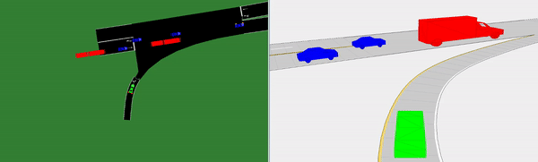
</p>

## MATLAB&reg; Toolbox Dependencies
Requires MATLAB release R2021a or newer with the following toolboxes:
- [Automated Driving Toolbox&trade;](https://www.mathworks.com/products/automated-driving.html)
- [Navigation Toolbox&trade;](https://www.mathworks.com/products/navigation.html#:~:text=Navigation%20Toolbox%E2%84%A2)
- [Robotics Systems Toolbox&trade;](https://www.mathworks.com/products/robotics.html)
- [Image Processing Toolbox&trade;](https://www.mathworks.com/products/image.html)
- [Computer Vision Toolbox&trade;](https://www.mathworks.com/products/computer-vision.html)
- [Sensor Fusion and Tracking Toolbox&trade;](https://www.mathworks.com/products/sensor-fusion-and-tracking.html)
- [Reinforcement Learning Toolbox&trade;](https://www.mathworks.com/products/reinforcement-learning.html)
- [Deep Learning Toolbox&trade;](https://www.mathworks.com/products/deep-learning.html)

## Third Party Products:
Deep Traffic Lab uses the following external dependencies 
- [SUMO](https://www.eclipse.org/sumo/) (1.9.2 or newer)
- [TraCI4Matlab](https://www.mathworks.com/matlabcentral/fileexchange/44805-traci4matlab)
- [INPOLY](https://github.com/dengwirda/inpoly)

**NOTE:** Currently Deep Traffic Lab supports Windows 10 only. Support for macOS and Linux will come in the future.

## Setup 
To install:
1. Install SUMO 1.9.2 or newer ([instructions](https://sumo.dlr.de/docs/Installing/index.html)) 
2. Configure SUMO_HOME as an environment variable ([instructions](https://sumo.dlr.de/docs/Basics/Basic_Computer_Skills.html#windows))
3. Clone Git repository
```
git clone <[URL to Git repo]>
```
4. Initialize submodules by running
```
git submodule update --init
```
5. Open MATLAB
6. Navigate to Open Traffic Lab repository
7. Run ./scripts/install.m

**Note:** Step 7 needs to be run every time that the MATLAB path resets

## Getting Started 

Deep traffic lab follows the workflow as shown below:
<p align="center">
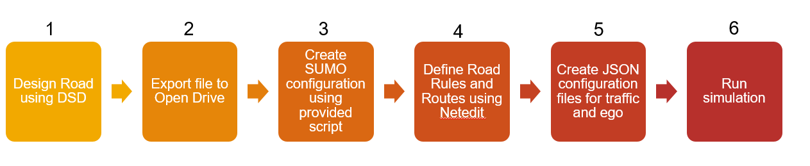
</p>


### *Reinforcement Learning:*
In order to run a reinforcement learning training, the user can refer to the [example](./Example/StraightHighwayDiscreteMetaAction/main.m) that comes with this repository. 

To be able to run a reinforcement learning training, the user needs to define a MATLAB compatible environment. This can be done by modifying the template environment that comes with this repository ([DiscreteHighwayEnvironment.m](Example/StraightHighwayDiscreteMetaAction/DiscreteHighwayEnvironment.m)) and  can be used as template to modify and use custom applications as needed by user.

The provided example comes with a default .json configuration for Ego Vehicles and for traffic vehicles. However, if needed the user can modify the configuration files by modifying the provided templates to define [EgoVehicles](Example\StraightHighwayDiscreteMetaAction\SingleEgoMinimalSensorsConfigTemplate.m) and to define [TrafficVehicles](Example/StraightHighwayDiscreteMetaAction/TrafficConfigTemplate.m). 

Additionally, inside the EgoConfig.json file, the user needs to properly define the sensors to be used by the Ego Vehicle. For a list of available sensors, refer to the [EgoTemplate](ConfigurationTemplates/TwoEgoSensorsConfigTemplate.m) file, where an array of Cameras, Lidars, and Radars are defined. These sensors will be used as part of the observation space for the reinforcement learning environment.

For more details on how to generate a neural netrwork for your RL agent, please see [here](https://www.mathworks.com/help/reinforcement-learning/ug/create-agent-using-deep-network-designer-and-train-using-image-observations.html)

<p align="center">
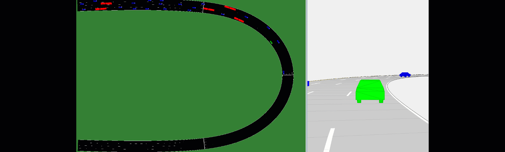
</p>

***Note:*** Despite the ability to define more than just one ego vehicle, Deep Traffic Lab does not support multi-agent reinforcement learning training at the moment since current support for multi-agent environment training is done using Simulink&reg;. Official support from Deep Traffic Lab for multi-agent may come in the future
### *Discrete/Continuous Control:*
Deep Traffic Lab can be used with a control mechanism instead of a learning mechanism. In [this](TestScripts\TestContinuousModelStanley\TestModelStanleyController.m) example, a stanley controller is used on the ego vehicle. The controlled vehicle uses a discrete bicycle model to follow a set of waypoints on a straight road.

<p align="center">
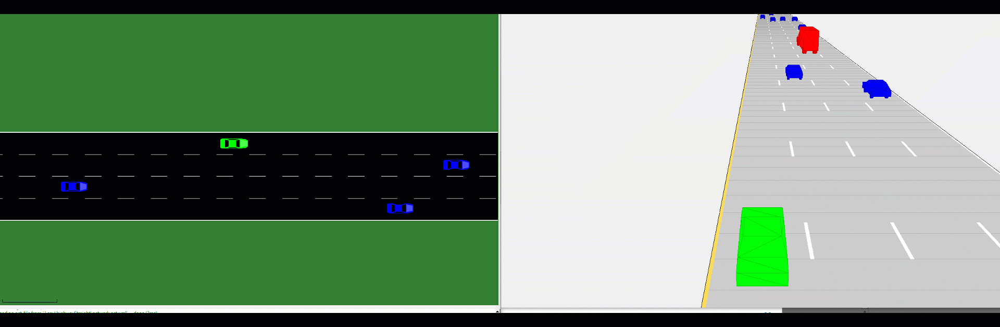
</p>

### *Defining Custom Networks:*
Deep Traffic Lab uses [Driving Scenario Designer App](https://www.mathworks.com/help/driving/ref/drivingscenariodesigner-app.html) to define roads interactively. To define custom scenarios follow the instructions depicted below

1. Create the road topology as described [here](https://www.mathworks.com/videos/driving-scenario-designer-1529302116471.html)
2. If a straight road is defined, it is a good practice to split the roads into more than one segments to be able to define routes laters
3. Export scenario into MATLAB function 
4. Export road topology to OpenDRIVE
<p align="center">  
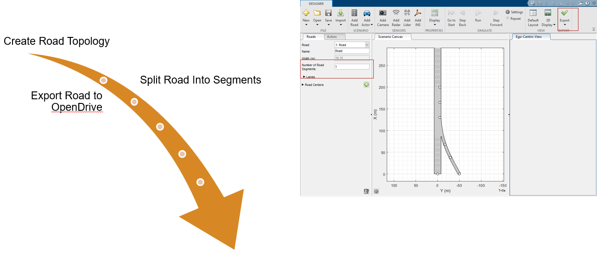
</p>

4. Open [scripts/GenerateEnvrionmentFiles.m](scripts/GenerateEnvironmentFiles.m) 
5. Specify paths to generated .xodr files and target folders to generate network files

<p align="center">  
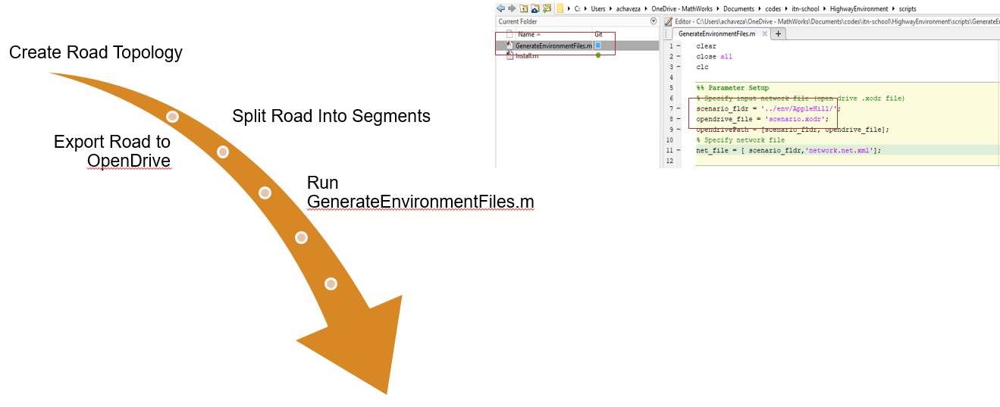
</p>

6. First, a SUMO .net.xml file will be created using SUMO's [netconvert](https://sumo.dlr.de/docs/netconvert.html) tool. After the conversion, SUMO's [Netedit](https://sumo.dlr.de/docs/Netedit/index.html#changing_connections]) will pop up.
7. Define traffic rules such as speed limits, and allowed vehicles on each road as shown below

<p align="center">  
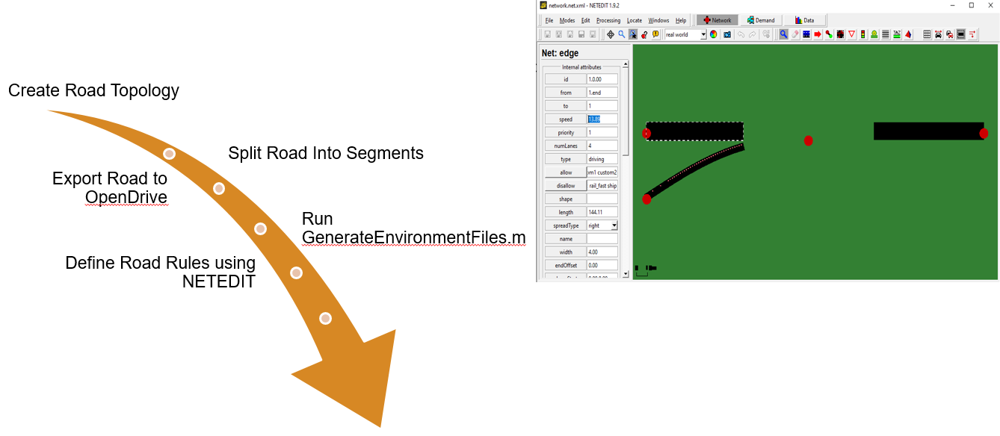
</p>


8. Go to Demand tab inside of NETEDIT
9. Select Route icon 
10. Define available routes by selecting edges

<p align="center">  
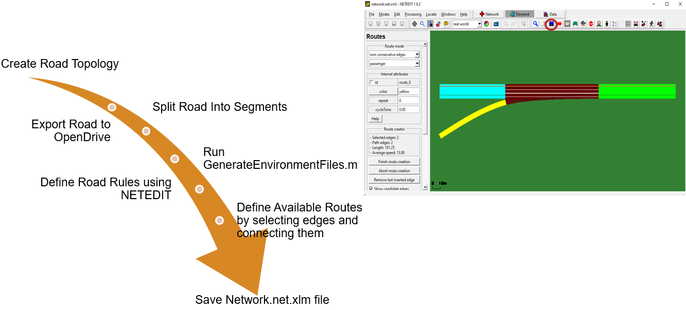
</p>

10.  If a route should be exclusively defined for ego vehicles, define the route ID as "ego_route". Deep Traffic Lab will only spawn ego_vehicles within this route
10. Save network and route file as "network.net.xml" and "Routes.rou.xml" respectively
11. In order to be able to use the newly created environment, a SUMO configuration file needs to be created. The user can modigy the [.sumocfg](highwayConfiguration.sumocfg) file that comes with this repository. For more information on how to create a .sumocfg file please refer to SUMO documentation.

### *Defining Configuration Files:*

Deep Traffic Lab uses a SUMO configuration file to call the corresponding SUMO network and route files (see SUMO documentation for more information). However, in order to specify the details and configurations for the Ego Vehicles and Traffic Vehicles, DTL uses .json files as a standard. In order to create the JSON configuration files, a template script is provided for the Ego Vehicles and Traffic Vehicles respectively. For more information on how to use them, please go to [ConfigurationTemplates](ConfigurationTemplates) folder.

The overall structure of each configuration file is shown as follows:

<p align="center">  
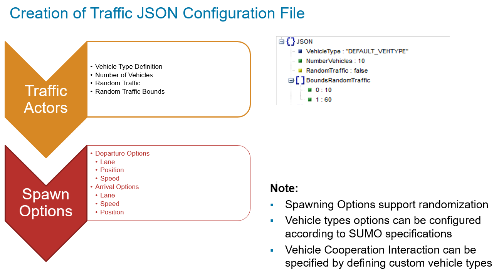
</p>

<p align="center">  
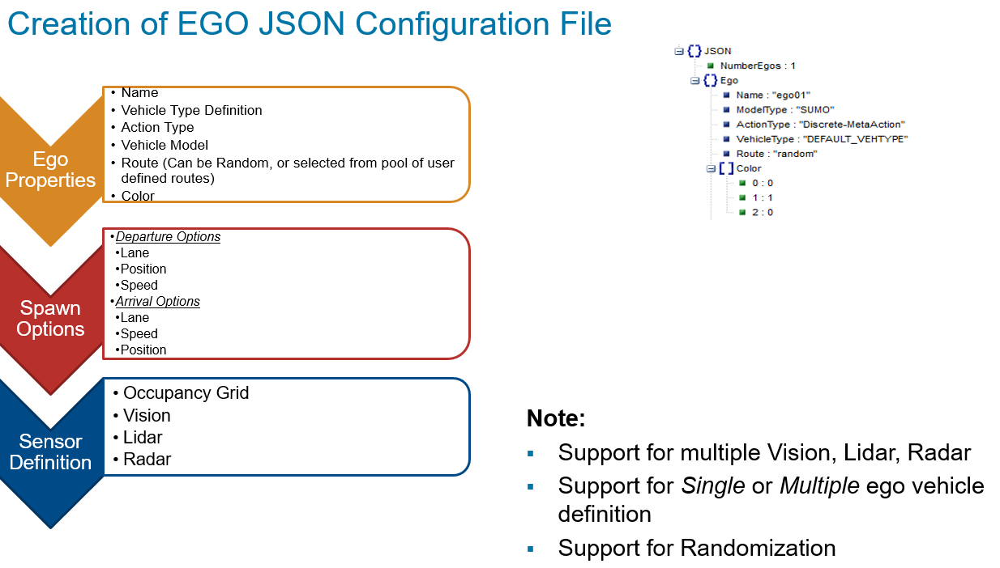
</p>

An example of two ego configuration files is shown as follows:

<p align="center">  
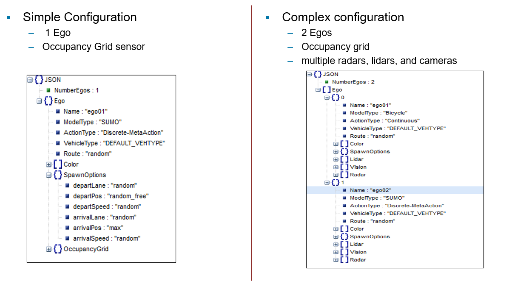
</p>

### *Defining Traffic Environment:*
In order to be able to run Deep Traffic Lab, the simulator requires a set of configuration files in addition to the simulation StopTime, SampleTime, and a boolean indicating if SUMO gui should be invoqued as shown on the code snippet below. 
```
scenario = highwayStraight();
SampleTime = 0.1; %[sec]
StopTime = SampleTime*1000; %[sec]
```
```
highwayEnv = TrafficEnvironment(scenario, ...
    sumoConfigFile, ...
    egoConfigFile,...
    trafficConfigFile,...
    StopTime,...
    'SampleTime', SampleTime,...
    'SumoVisualization', true);
```

The variable "scenario" corresponds to the road topology defined programmatically or using Driving Scenario Designer App and describes the same road topology that is used by SUMO. Make sure that the .sumocfg file routes and network correspond to the same network.

After *"TrafficEnvrionment"* has been defined, the user can call a visualization of the environment by choosing a vehicle randomly 

```
highwayEnv.create_random_visualization;
```
or by calling the name of an specific vehicle 

```
highwayEnv.create_chase_visualization('ego01');
```

<p align="center">  
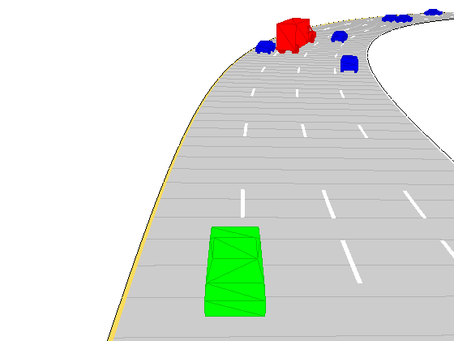
</p>

In order to deploy traffic, the following member method can be called

```
[hasBeenCreated, numberOfTrafficActors, egos] = highwayEnv.deploy_traffic();
```

*"deploy_traffic"* method, as it names suggests, deploys traffic on the scenario. Additionally, it returns the following parameters: 

- *hasBeenCreated:* boolean that specifies wether the creation of the environment has been successfull
- *numberOfTrafficActors:* Integer describing how many actors were created
- *egos:* a cell list that contains a handle to the ego vehicles. Using this handle, the user can monitor the ego states, current status, and call the step function for the ego, which takes a control input as its parameters

Additionally, when *"deploy_traffic"* method is called, the current traffic is despawned, so this method also works as a reset function.

## Examples
To learn how to use this in testing workflows, see [Examples](/examples/) or [TestScripts](TestScripts/). 

## Architecture
Deep Traffic Lab uses three main classes that define the architecture of the environment without taking into account the RLEnv class which serves as template for the users to define an environment according to their needs. The functionality of each class is described below.

- **TrafficEnvironment:** This class is the one in charge to define the connection between the environment in MATLAB and SUMO respectively. Additionally, it uses the configuration files, specified by the user, to create and deploy traffic according to the specifications from the user. This class is also in charge of creating chase plot visualizations within the driving scenario in MATLAB. *TraffiicEnvironment* allows the user to define the lane changing model within SUMO, this can be a sublane model, or a prespecified fixed time lane changing time window. For more details refer to [SUMO Documentations](https://sumo.dlr.de/docs/Simulation/SublaneModel.html) and the [Class Documentation](lib/@TrafficEnvironment/TrafficEnvironment.m) on the constructor method.
- **TrafficVehicle:** This class represent each of the vehicles in the simulation. Thus, it is in charge of defining the physical properties of the vehicle in the simulation and synchronize it between SUMO and MATLAB. Due to the architecture from Driving Scenario World in MATLAB, actors in MATLAB that have finished their route in SUMO, are placed in a location far away from the scenario. *TrafficVehicle* class recycles "despawned" vehicles when a new instance of a vehicle is created inside SUMO.
- **EgoVehicle:** This class inherits from *TrafficVehicle* class and uses the same methods as the parent class. However, this class is also in charge of defining the vehicle model (SUMO, Bicycle) used to control the "Ego Vehicles" using the defined action space (DiscreteMeta-Action, Discrete, Continuous) specified by the user on the configuration files. Additionally, this class is in charge of defining the sensors and observations that the ego vehicle will use during the simulation (ideal, lidar, radar, camera, occupancy grid).

A diagram with the public methods that each class uses is shown below

<p align="center">  
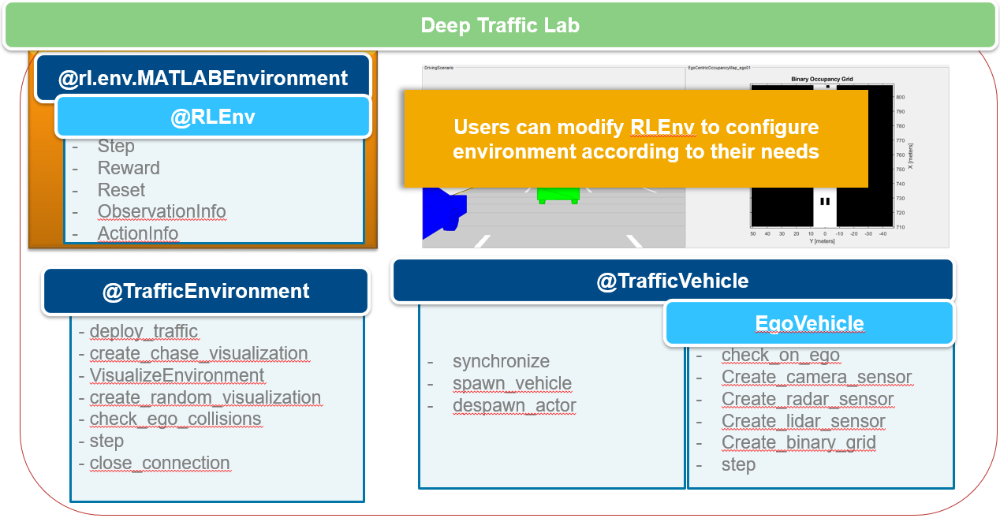
</p>

Similarly, the initialization architecture for Deep Traffic Lab is described on the diagram below

<p align="center">  
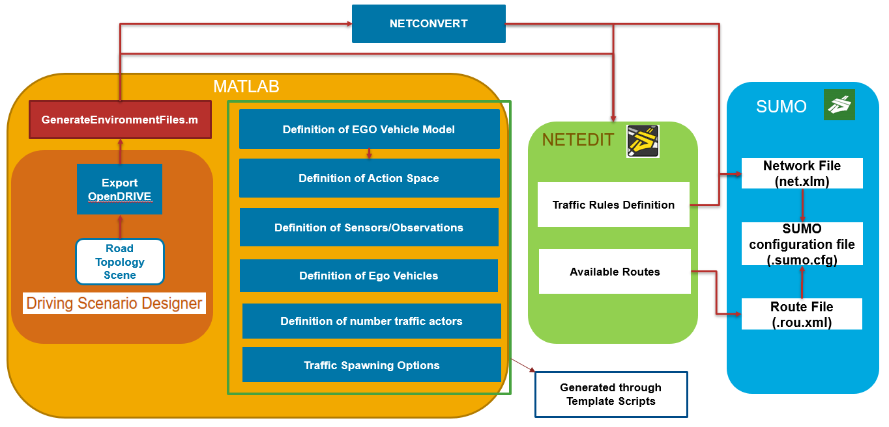
</p>

where the available options are as follows
<p align="center">  
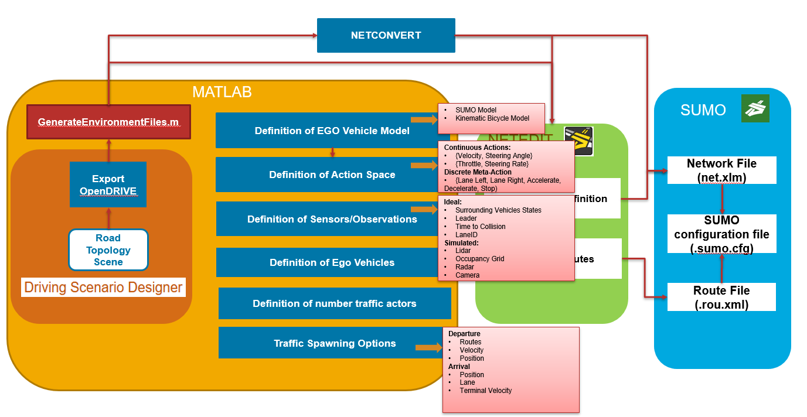
</p>

Once the environment has been fully specified, the runtime synchronization is described on the diagram below
<p align="center">  
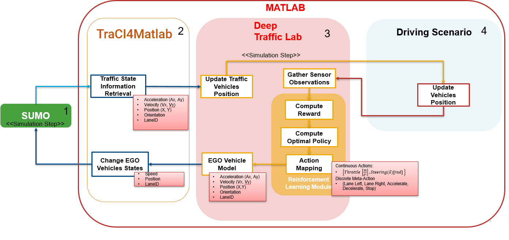
</p>


## Current Limitations
- RL training only supports single agent environments
- Parallel training of RL Agents is not currently supported 
- The specified number of traffic actors withing trafficConfig.json file, may differ from the actual number of spawned vehicles due to space limitations inside of road
- SUMO road topologies might differ from MATLAB road topologies due to issues when exporting Driving Scenario Designer topology to OpenDRIVE's .xodr file. For more information see [here](https://www.mathworks.com/help/driving/ref/drivingscenario.export.html#mw_fea198e6-827f-49bd-a1f5-4c953b2139b1).
- SUMO induction loops, or flows are not supported
- Lidar point clouds might throw an error due a bug. This bug has been fixed for future releases (MATLAB r2021b)
- When defining a continuous model for the ego vehicle, there exist a two step delay on the Ego Vehices due to synchronization architecture between SUMO and DSD. Thus, it is advised to use a small time step


## License
The license for Deep Traffic Lab is available in the [LICENSE.TXT](LICENSE.TXT) file in this GitHub repository.

## Community Support
[MATLAB Central](https://www.mathworks.com/matlabcentral)

Copyright 2021 The MathWorks, Inc.
